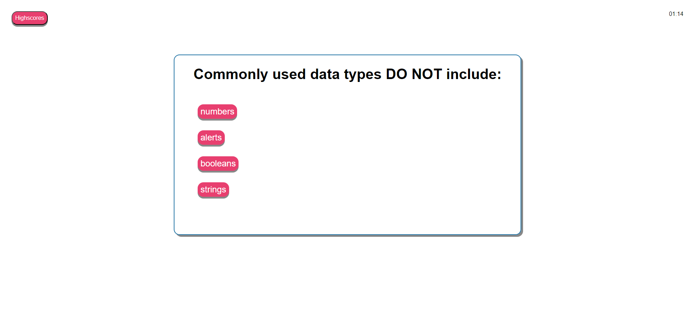

# Code Quiz JavaScript Fundermentals

## GitPage

[Link to page](https://amillsy.github.io/Code-Quiz-JavaScript-Fundermentals/)

## User Story

```
AS A coding boot camp student
I WANT to take a timed quiz on JavaScript fundamentals that stores high scores
SO THAT I can gauge my progress compared to my peers
```

## Acceptance Criteria

```
GIVEN I am taking a code quiz
WHEN I click the start button
THEN a timer starts and I am presented with a question
WHEN I answer a question
THEN I am presented with another question
WHEN I answer a question incorrectly
THEN time is subtracted from the clock
WHEN all questions are answered or the timer reaches 0
THEN the game is over
WHEN the game is over
THEN I can save my initials and my score
```

## What I learnt

This was the first week using Javascript, CSS and HTML all into a singular project. So I think the major thing I learnt was
how all the files interacted with each other and the use of Javascript to make a fully interactive page that people can
enjoy.

Furthermore, As it was the first time having to build something from scratch with all the components, time management was
a big factor as having problems within JavaScript would sometimes run over into the next document and you would have to rewrite
entire sections. This made me realise that I need to focus on the functionality over the style and how the website looks as when
taking this path lead me to be more successful and save time.

In addition, learning how JavaScript react with the page and testing all its functions that allow the developer to create a great experience
was really interesting. JavaScript has infinite possibilities and is only stopped by the developer's own thoughts which is amazing because
it made me appreciate that anything can be created, I just have to find the solution.

## Usage

A user is able to go onto the website and take a quiz to see how good there JavaScript knowledge is. After taking the quiz they will be put into a
scoreboard which is stored on local storage, so if another person decide to play on the same computer they will be able to see who is the most
knowledgable

### Welcome

First the player will presented with a welcome screen that tells them the rules.


### Quiz

After the player presses start game they will presented with questions and a timer will tick down for 75 seconds


### Highscore Submission

Here the player will be able to enter there initials and then there score will be stored in the data base.


### Scoreboard

It has a ordered list of the scores the players have got and if the list is too large, they are able to scroll down to see all the scores

